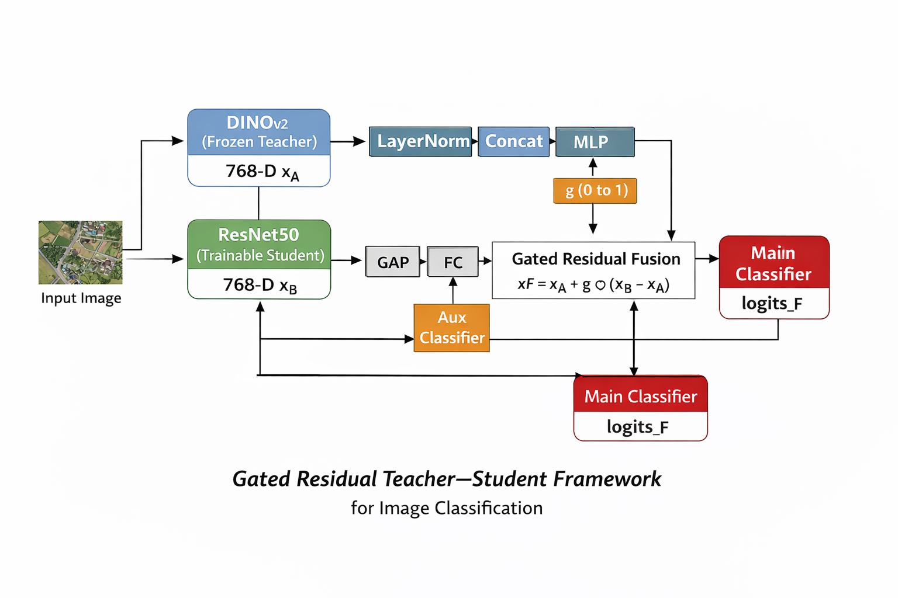

# A Gated Residual Teacher–Student Framework for Feature Refinement in Image Classification

**Sudipta Sarkar**  
Email: sudiptasarkar3600@gmail.com  
Year: 2026  

---

## Abstract

We propose a **Gated Residual Teacher–Student (GRTS) framework** for image classification, where a frozen self-supervised teacher provides stable semantic priors and a trainable student contributes dataset-specific discriminative cues. A learnable gating mechanism adaptively refines student features relative to the teacher, enabling effective representation learning under limited data regimes. The proposed method demonstrates strong performance on aerial image classification benchmarks, particularly in low-data settings.

---

## 1. Introduction

Deep neural networks often struggle with overfitting when trained on small datasets. Recent self-supervised vision foundation models encode rich semantic representations but lack task-specific adaptability when frozen.  

To address this, we introduce a **teacher–student feature refinement framework** that:
- Preserves the generalization ability of a frozen teacher
- Injects discriminative power from a lightweight student
- Uses a **learnable gated residual fusion** to control feature adaptation

---

## 2. Method

### 2.1 Overall Architecture

The framework consists of:
- A frozen **DINOv2** teacher network
- A trainable **ResNet50** student network
- A gated residual feature refinement module
- Auxiliary and main classification heads

```

Input Image
│
├──► DINOv2 (frozen) ──► xA (768)
│
└──► ResNet50 ──► GAP ──► Linear ──► xB (768)
│
└──► Aux Classifier ──► logits_B

xA, xB ──► LayerNorm ──► Concat ──► MLP ──► Sigmoid ──► g
xF = xA + g ⊙ (xB − xA)

xF ──► Main Classifier ──► logits_F

````

---

**Summary:**
- **This work:** A Gated Residual Teacher--Student Framework for Feature Refinement in Image Classification.
- **Best for:** Smaller datasets (strong performance with limited data).

**Datasets**
- **UC Merced (`uc_merced`)**: aerial land-use dataset used in experiments.
- **AID (`aid`)**: Aerial Image Dataset (satellite) used in experiments.

Dataset folder layout (required):

```
<dataset_root>/
  train/   # training images organized by class subfolders
  val/     # validation images organized by class subfolders
```

- Recommended split: 80% train / 20% val (create `train` and `val` subfolders before training).

If you need a quick split script, use your preferred tool or the following minimal example:

```python
# quick_split.py (example)
import os, random, shutil
from pathlib import Path

def split_dataset(src, dst, train_ratio=0.8):
    src = Path(src)
    for cls in [d for d in src.iterdir() if d.is_dir()]:
        imgs = list(cls.glob('*'))
        random.shuffle(imgs)
        cut = int(len(imgs)*train_ratio)
        (dst/'train'/cls.name).mkdir(parents=True, exist_ok=True)
        (dst/'val'/cls.name).mkdir(parents=True, exist_ok=True)
        for p in imgs[:cut]: shutil.copy(p, dst/'train'/cls.name)
        for p in imgs[cut:]: shutil.copy(p, dst/'val'/cls.name)

```

**Install requirements**

```bash
pip install -r requirements.txt
```

**Training commands (examples)**

- UC Merced (example):

```bash
python -m torch.distributed.launch --nproc_per_node=1 main.py \
  --data_dir /home/others/J20250297/Sudipta/ANET/Dataset/UCMerced_LandUse \
  --dataset uc_merced --opt adamw --lr 8e-4 --min-lr 1e-6 --epochs 50 \
  --sched cosine --batch-size 20 --num_workers 4 --mixup 0.8 --cutmix 1.0 \
  --drop-path 0.2 --warmup-epochs 5 --no-amp --input_size 224 \
  --output_dir /home/others/J20250297/Sudipta/ANET/GRTS/output/ucm/test1 \
  --weight-decay 0.05 --clip-grad 1.0 --smoothing 0.02 --dropout 0.2
```

- AID (example):

```bash
python -m torch.distributed.launch --nproc_per_node=1 main.py \
  --data_dir /home/others/J20250297/Sudipta/ANET/Dataset/AID \
  --dataset aid --opt adamw --lr 2e-4 --min-lr 1e-6 --epochs 50 \
  --sched cosine --batch-size 20 --num_workers 4 --mixup 0.8 --cutmix 1.0 \
  --drop-path 0.02 --warmup-epochs 5 --no-amp --input_size 224 \
  --output_dir /home/others/J20250297/Sudipta/ANET/GRTS/output/aid/test_10 \
  --weight-decay 0.05 --clip-grad 1.0 --smoothing 0.02 --dropout 0.4
```

**Evaluation (example)**

Use the `--eval` flag and supply a checkpoint using the resume flag shown below (replace with your checkpoint path):

```bash
python -m torch.distributed.launch --nproc_per_node=1 main.py \
  --data_dir /path/to/dataset --dataset uc_merced --resume /path/to/checkpoint.pth --eval \
  --batch-size 20 --input_size 224 --output_dir /path/to/output
```

Note: the code accepts `--resume` for loading a checkpoint before evaluation. If you prefer a different flag (e.g. `--chpt`), adapt the code accordingly.

**Model (architecture overview)**

Input Image
  │
  ├──► DINOv2 (frozen) ──► xA (768)
  │
  └──► ResNet50 ──► GAP ──► Linear ──► xB (768)
                           │
                           └──► Aux Classifier ──► logits_B

xA, xB ──► LayerNorm ──► Concat ──► MLP ──► Sigmoid ──► g
xF = xA + g ⊙ (xB - xA)

xF ──► Main Classifier ──► logits_F

An illustration image can be placed here:



**Results**
| Dataset   | Accuracy (%) |
| --------- | ------------ |
| UC Merced | **97.81**    |
| AID       | **96.81**    |


**Checkpoints**
- Checkpoints will be available soon: [Checkpoint link placeholder]

**Notes & tips**
- Ensure `train` and `val` subfolders exist under your dataset root before running training.
- This model is particularly effective on smaller datasets due to the frozen teacher (DINOv2) providing stable priors.
- If you encounter issues with distributed launch on your platform, try running single-process training by invoking `python main.py ...` and adjusting batch size.

For questions or to share results, contact Sudipta Sarkar.
## Contact

Sudipta Sarkar
📧 [sudiptasarkar3600@gmail.com](mailto:sudiptasarkar3600@gmail.com)

© 2026 Sudipta Sarkar


